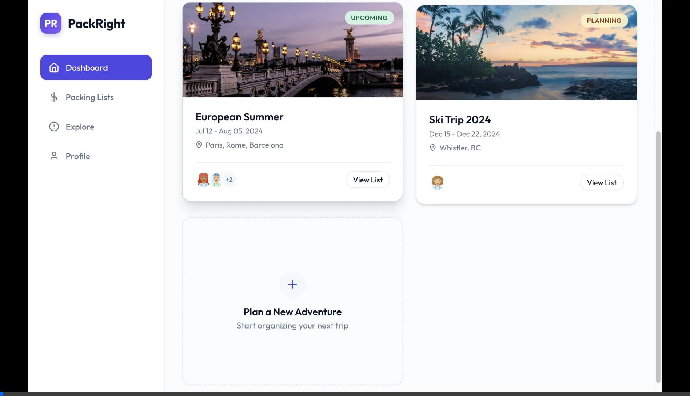
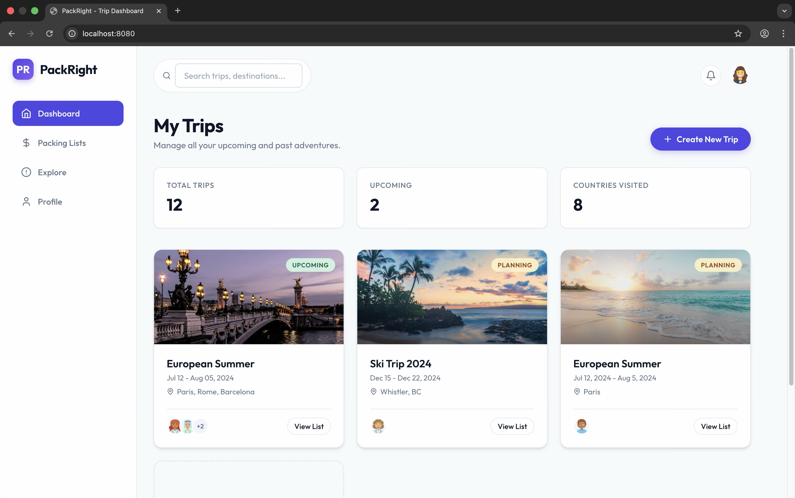
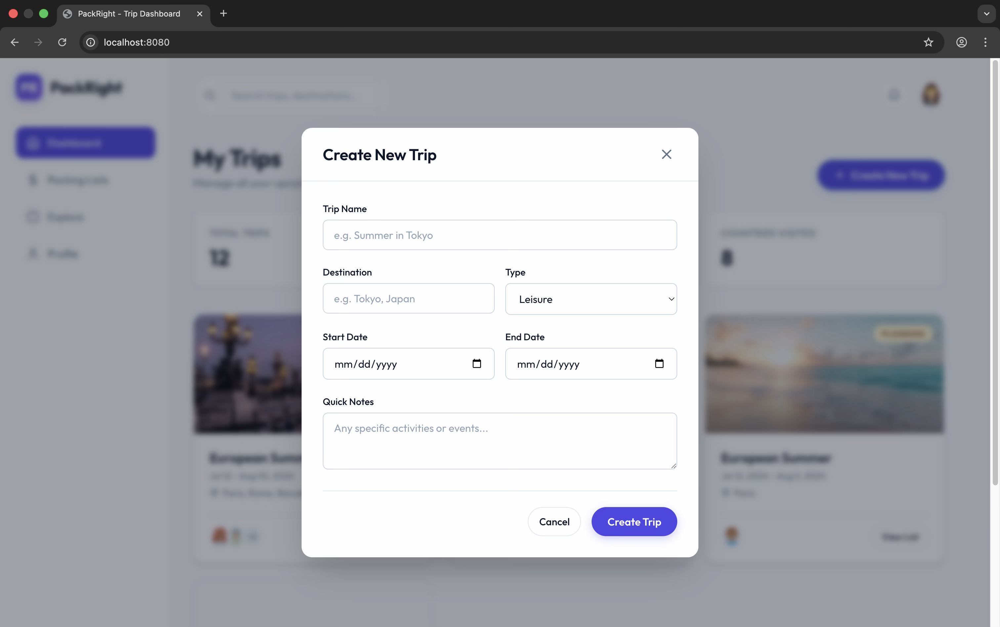

# PackRight Trip Dashboard & Create Trip Modal Walkthrough

We have successfully implemented the Trip Dashboard and "Create Trip" modal for **PackRight** using a purely Vanilla web stack.

## What Was Done
1. **Foundation & Layout**: 
   - Created a responsive layout in [index.html](file:///Users/likhithreddyrechintala/Documents/Projects/cs7180-vibecoding/projects/packright/index.html) featuring a persistent sidebar and top navigation.
   - Built a custom, premium design system in [index.css](file:///Users/likhithreddyrechintala/Documents/Projects/cs7180-vibecoding/projects/packright/index.css) using sleek variables, modern typography (Outfit font), and deep drop shadows.
2. **Dashboard Overview**:
   - Implemented "Trip Cards" to showcase upcoming and past trips with beautiful Unsplash background images.
   - Designed hover micro-animations that elevate cards and adjust shadow depth to provide a tangible feel.
3. **Create Trip Modal**:
   - Built a sleek, glassmorphic modal overlay (`backdrop-filter`) containing a rich form.
   - Linked vanilla JS ([script.js](file:///Users/likhithreddyrechintala/Documents/Projects/cs7180-vibecoding/projects/packright/script.js)) to toggle the modal efficiently without blocking the main interaction thread.
   - Added a form submission simulation that dynamically prepends new trip cards into the DOM with a smooth `.fade-in` animation.

## Verification
A browser subagent mechanically verified the flow by filling out and submitting the form dummy data, validating that:
- Hover interactions work smoothly.
- The "Create New Trip" button successfully reveals the modal.
- Inputting data into the form and hitting "Create Trip" gracefully closes the modal and adds the new trip to the top of the grid UI.

## Media
Watch the browser subagent interact with the UI:

And here are the screenshots of the trip dashboard and the filled-in modal right before submission:

